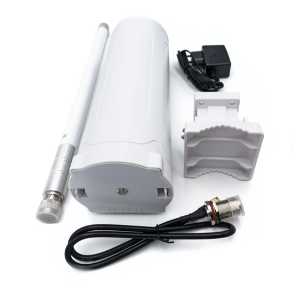
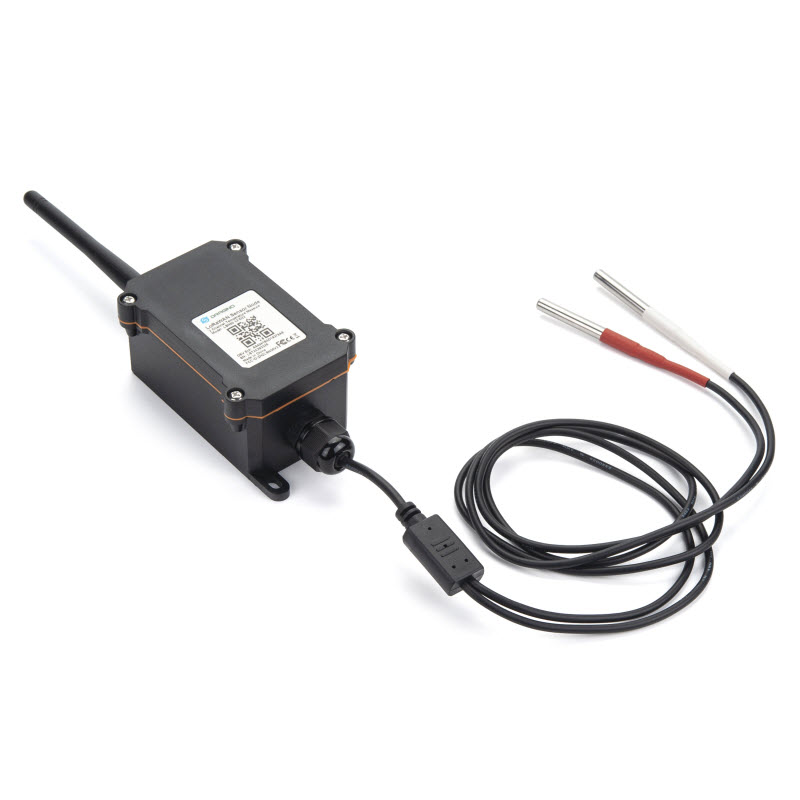
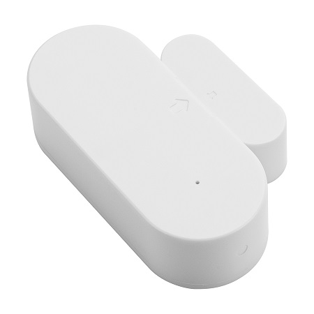
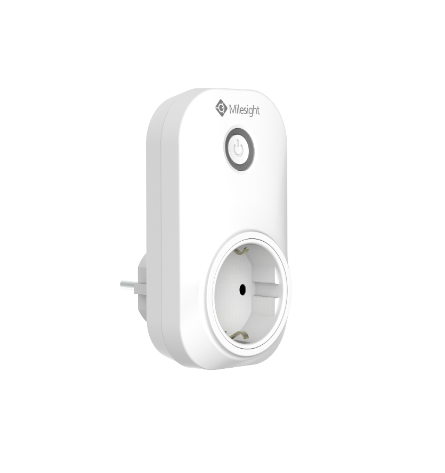
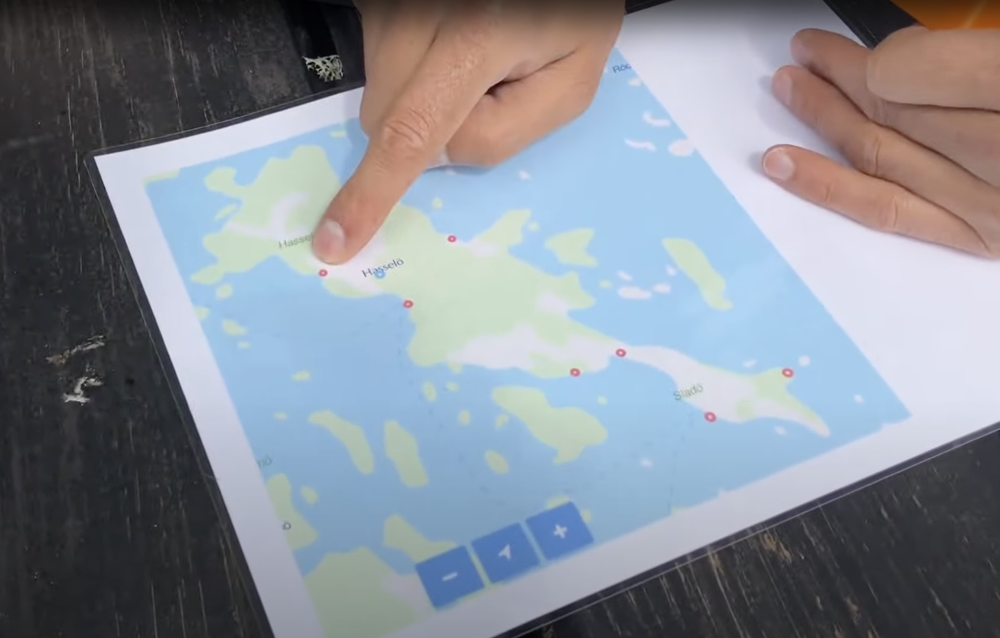
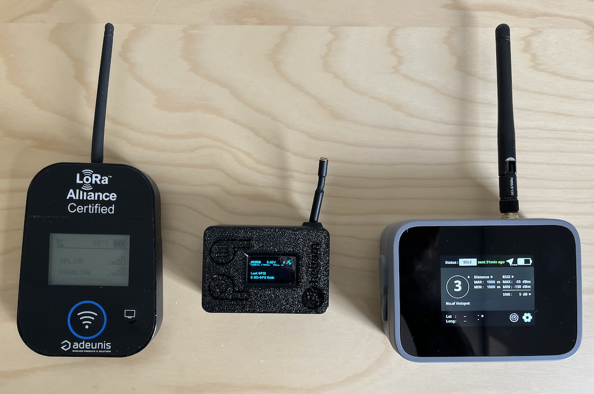

# iotlab-pilotcase-hasselö

Hasselö, located in the Tjust archipelago between Västervik and Loftahammar in northern Småland, offers a variety of activities, accommodations, and services for visitors. The island, along with the neighboring Sladö nature reserve, features diverse landscapes including lush deciduous forests, barren pine forests, meadows, and bare rocks. Visitors can enjoy various lodging options such as hostels, cottages, guest harbors, and camping facilities.

Hasselö aims to provide real-time water temperature information to visitors and ensure that ice cream freezers are properly monitored to prevent spoilage, including detecting if freezer doors are left open too long or if there is a power outage. A primary goal is to achieve reliable LoRaWAN coverage by strategically placing the antenna and using mappers to confirm coverage at different points of interest.

- [iotlab-pilotcase-hasselö](#iotlab-pilotcase-hasselö)
  - [LoRaWAN Gateway](#lorawan-gateway)
  - [LoRaWAN Sensors](#lorawan-sensors)
  - [Getting started](#getting-started)
    - [Sensor configuration](#sensor-configuration)
  - [Results](#results)

## LoRaWAN Gateway

The gateway we will use in the pilot case is the Dragino DLOS8N Outdoor LoRaWAN Gateway (8 channels). The gateway is IP65-rated and can be mounted on a pole or wall.

|  | Dragino DLOS8N Outdoor LoRaWAN Gateway | [€297.38 - Dragino DLOS8N Outdoor LoRaWAN Gateway](https://iot-shop.de/en/shop/dragino-dlos8n-outdoor-lorawan-gateway-5841?category=7&search=LoRaWAN+Gateway#attr=17051,20022,6145,20023,14699) |
| --------------------------------------------------------------- | -------------------------------------- | ----------------------------------------------------------------------------------------------------------------------------------------------------------------------------------------------- |

## LoRaWAN Sensors

The table below lists the sensors that we will use in the pilot case.

|  | Waterproof temperature sensor with two sensor probes, LoRaWAN | [€95 - Waterproof temperature sensor with two sensor probes, LoRaWAN](https://www.direktronik.se/direktronik/overvakning/automationscada/lorawan/temperatursensor-med-tva-probe-utomhus-lorawan/?variationCode=20114848) |
| ------------------------------------------------------------------- | ------------------------------------------------------------- | ------------------------------------------------------------------------------------------------------------------------------------------------------------------------------------------------------------------------ |

|  | Door/Windows sensor | [€35 - Door/Windows sensor](https://www.direktronik.se/direktronik/overvakning/automationscada/lorawan/dorrsensor-lorawan/?variantCode=20114805&gad_source=1&gclid=CjwKCAjwmYCzBhA6EiwAxFwfgLxHtuUPkA72Gi1gtZ8igMFyDAJmTQ1UJelxHvNkd3b5A6B9HwyZxRoC9TUQAvD_BwE) |
| ------------------------------------------------------------------- | ------------------- | --------------------------------------------------------------------------------------------------------------------------------------------------------------------------------------------------------------------------------------------------------------- |

|  | LoRaWAN Smart Plug | [€90 - LoRaWAN Smart Plug](https://www.direktronik.se/direktronik/overvakning/automationscada/lorawan/lorawan-smartplug-styr-ditt-vagguttag/) |
| ----------------------------------------------------------------- | ------------------ | --------------------------------------------------------------------------------------------------------------------------------------------- |

## Getting started

1. Update the firmware on the Dragino DLOS8N Outdoor LoRaWAN Gateway, visit [this guide](firmware.md).

2. Configure the Dragino DLOS8N Outdoor LoRaWAN Gateway for the Helium network, visit [this guide](helium.md).

### Sensor configuration

1. **Waterproof temperature sensor with two sensor probes, LoRaWAN**

   - Configure the sensor to send every 6 hours (21600 seconds) by queueing the downlink message `0x01005460` under the `Device page` -> `Queue` -> fill in `0x01005460` and `Enqueue`. More on the configuration can be found under [4.1 Change Uplink Interval](http://wiki.dragino.com/xwiki/bin/view/Main/End%20Device%20AT%20Commands%20and%20Downlink%20Command/#H4.1ChangeUplinkInterval).

## Results

On July 17th, 2024, we installed the gateway and onboarded the sensors to the network ([This console](https://console.helium-iot.xyz/)). The Gateway was installed at the Hasselö hostel [57.83469981504573, 16.73108550629707](https://www.google.com/maps/place/Hassel%C3%B6+vandrarhem/@57.8347755,16.7300333,16.18z/data=!4m9!3m8!1s0x46585d5f8604aeb9:0x5ba1198a782808a0!5m2!4m1!1i2!8m2!3d57.8343886!4d16.7309925!16s%2Fg%2F1v41z1s4?entry=ttu) (blue dot on the map).

The antenna (3dBi) was mounted on the roof of the building, and the gateway was connected to the local network over Ethernet.

The 7 red dots on the map represent the points of interest (POIs) where we needed to test the coverage of LoRaWAN.

To map the coverage, we used an [Adeunis Field Tester](https://www.adeunis.com/en/produit/ftd-network-tester/), [CubeCell GPS-6502](https://heltec.org/project/htcc-ab02s/) and a [RAK Helium Field Mapper](https://store.rakwireless.com/products/field-mapper-for-helium-with-plug-play-and-3rd-party-mode-rak10701-h?variant=42437640782022)

The results of the coverage test are shown in the map below. Unfortunately, we did not have time to test all the POIs, but we will do that next time we visit the island. We also noticed that the coverage was not as good as we expected, so we will install another antenna higher up on the building and see if that improves the coverage.

Unfortunately, we did not have a more detailed coverage map (like [mappers.helium.com](https://mappers.helium.com/)) since the hexagons that indicate the coverage are only created if the gateway (data-only or full) is onboarded to the Helium network (e.g. on the blockchain).
